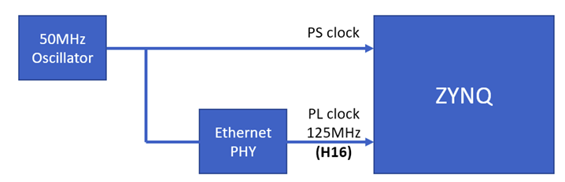
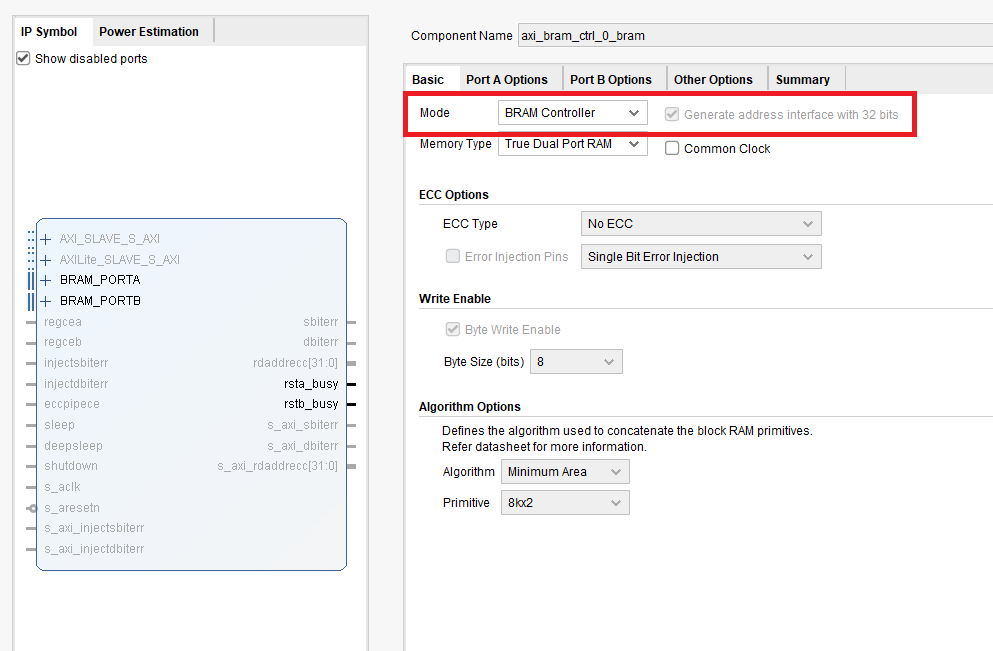
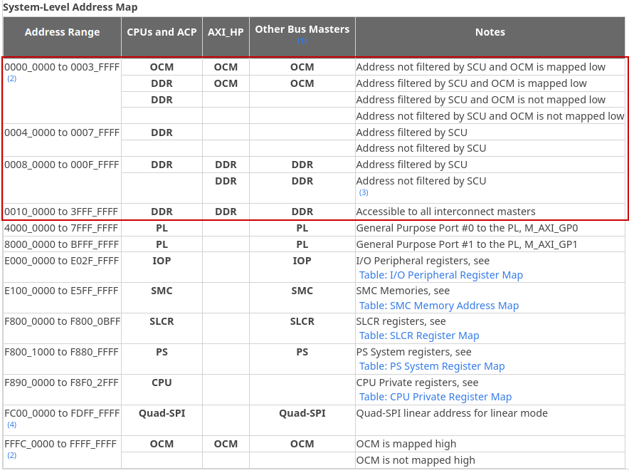
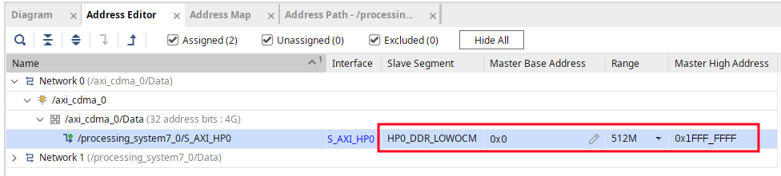
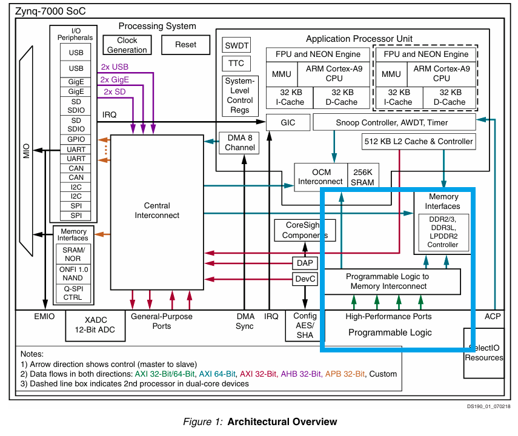
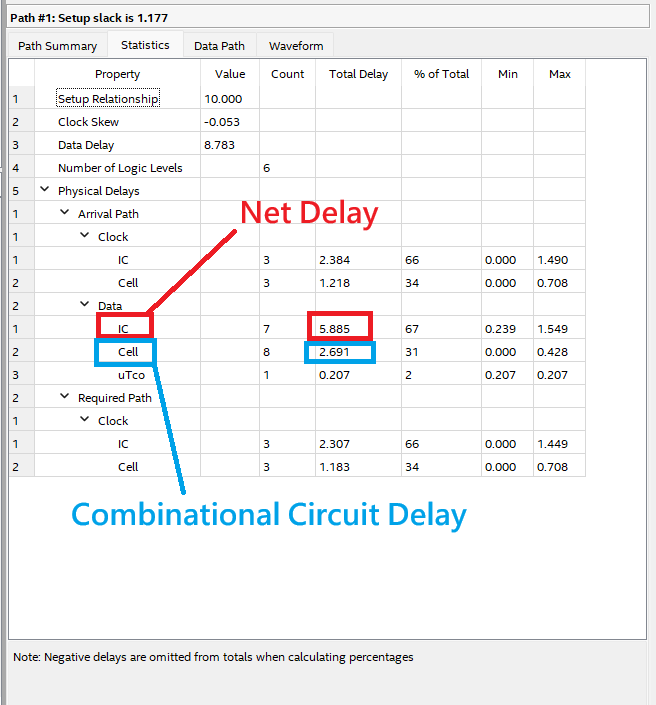
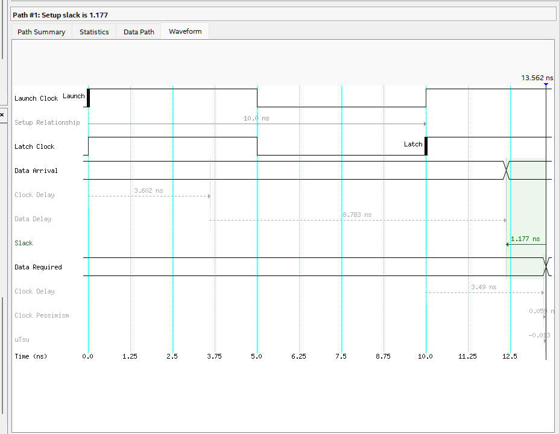
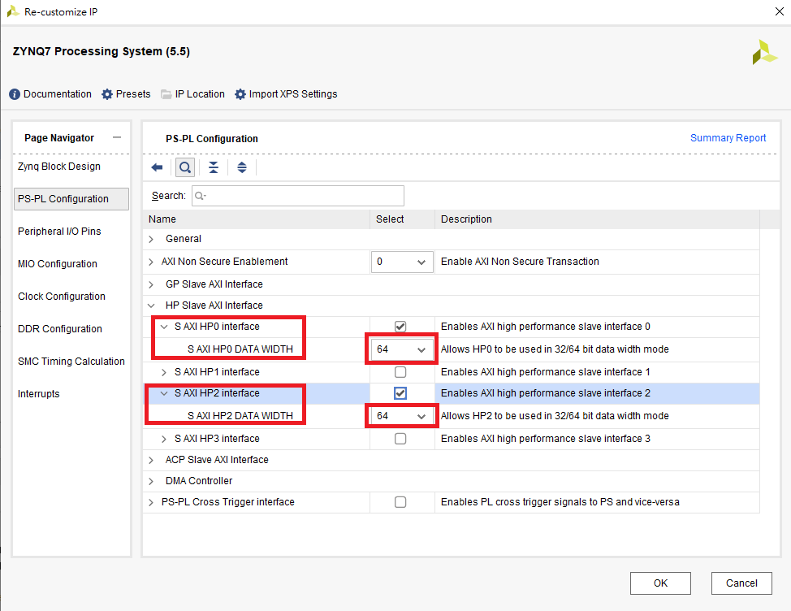

# Answer

## Q1


The 125 MHz clock on pin 16 (H16) of the PYNQ-Z2 board is generated by the onboard Ethernet PHY (RTL8211) and routed to the FPGA programmable logic (PL). This frequency is used because the PHY operates in Gigabit Ethernet mode, where a 1 Gb/s data rate is achieved using an 8-bit parallel interface.

The required clock frequency can be calculated as:

$125\ \text{MHz} = \frac{1\ \text{Gb/s}}{8\ \text{bits}}$


Using reference clocks generated by interface PHYs is a common practice in FPGA or motherboard designs. For example, PCI Express (PCIe) systems typically provide a 100 MHz reference clock, which is shared by the PCIe PHY and connected devices. Similarly, the Ethernet PHY on the PYNQ-Z2 provides a 125 MHz clock that can be reused by the FPGA.

For instance, the following excerpt from a U50 QSFP Master XDC shows how a dedicated clock generator and PHY-related reference clocks are used to generate and distribute multiple system clocks, including the 100 MHz PCIe reference clock, to the FPGA and connected interfaces:
```
#   U50QSFP - Master XDC 
#
#   Key Notes:
#       1) PCIe Clocks Support x16 and x8 Bifurcation with both synchronous or asynchronous operation
#       2) Power warning constraint set to warn user if design exceeds 63 Watts
#
#   Clock Tree
#           
#    1) SI5394 - SiLabs Si5394B-A10605-GM
#      - IN0 <-- feedback clock ETH_recovered_clk_P/ETH_recovered_clk_N 
#                PINS: IO_L12P_T1U_N10_GC_68_F19/IO_L12N_T1U_N11_GC_68_F18
#           
#      - IN1 Unconnected
#           
#      - IN2 Unconnected
#
#      - XA  RPT5032A 40.0000MHz TCXO 
#
#      - OUT0--> SYNCE_CLK_P/SYNCE_CLK_P @ 161.1328125Mhz 
#                PINS: MGTREFCLK0P_131_N36/MGTREFCLK0N_131_N37
#           
#      - OUT1--> CLK_1588_P/CLK_1588_P   @ 322.265625MHz  
#                PINS: MGTREFCLK1P_131_M38/MGTREFCLK1N_131_M39
#           
#      - OUT2 Unconnected
#            
#      - OUT3--> SYNCE_CLK_P/SYNCE_CLK_P @ 100.000Mhz 
#           |
#           |--> SI53306-B-GM --> OUT0  PCIE_SYSCLK0_P/PCIE_SYSCLK0_N 100.000Mhz 
#                             |   PINS: MGTREFCLK1P_227_AA11/MGTREFCLK1N_227_AA10
#                             |
#                             |-> OUT1  PCIE_SYSCLK1_P/PCIE_SYSCLK1_N 100.000Mhz 
#                             |   PINS: MGTREFCLK1P_225_AE11/MGTREFCLK1N_225_AE10
#                             |
#                             |-> OUT2  SYSCLK2_P/SYSCLK2_N 100.000Mhz
#                             |   PINS: IO_L11P_T1U_N8_GC_68/IO_L11N_T1U_N9_GC_68
#                             |
#                             |-> OUT3  SYSCLK3_P/SYSCLK3_N 100.000Mhz 
#                                 PINS: IO_L11P_T1U_N8_GC_64/IO_L11N_T1U_N9_GC_64
```

## Q2

### Word Addressing

In **word addressing**, each memory address refers to one complete data word (e.g., 16-bit, 32-bit, or 64-bit). Address increments move by one word at a time, and byte offsets within a word are not directly visible. Native FPGA BRAM ports typically use word addressing.

```
Example (word addressing, 32-bit word):

addr = 0 → word 0  
addr = 1 → word 1  
addr = 2 → word 2  
addr = 3 → word 3  
```

### Byte Addressing

In **byte addressing**, each memory address refers to a single byte (8 bits).
Multi-byte data objects occupy consecutive byte addresses. For example, a 32-bit word occupies four consecutive byte addresses. Byte addressing is commonly used in processor and bus interfaces such as AXI.

```
Example (byte addressing, 32-bit word):

addr = 0x00 → word 0  
addr = 0x01 → word 0  
addr = 0x02 → word 0  
addr = 0x03 → word 0  
addr = 0x04 → word 1  

Accessing consecutive words in byte addressing:

addr = 0x00 → word 0  
addr = 0x04 → word 1  
addr = 0x08 → word 2  
addr = 0x0C → word 3  
addr = 0x10 → word 4 
```

In this design, the BRAM is implemented using the Block Memory Generator IP
in BRAM Controller mode. When the option `Generate address interface with 32 bits`
is enabled, the BRAM exposes a byte-addressed interface.




As a result, the address supplied to the BRAM is interpreted as a byte address,
and the BRAM internally converts it to a word address by discarding the lower
address bits. Therefore, for a 32-bit word, the address must be incremented by 4
to access the next word.

```verilog
bram_addr = word_index << 2;
```

If this option were disabled, the BRAM would instead use word addressing, where
incrementing the address by 1 accesses the next word.


## Q3
Memory-mapped I/O (MMIO) is a mechanism in which peripheral devices are assigned addresses in the CPU’s memory address space. Although these addresses look like normal memory locations, they are actually used to route the access to different hardware blocks.

When the CPU accesses a GPIO MMIO address:

- The CPU issues a normal load or store instruction.
- The address is decoded by the system interconnect.
- Based on the address, the transaction is routed to the GPIO IP instead of DRAM.
- A write updates a GPIO control register and changes the pin output.
- A read returns the current GPIO pin or status value to the CPU.

In summary, MMIO uses memory addresses as routing information to direct CPU accesses either to DRAM or to hardware peripherals.

## Q4
The HP port provides a direct high-performance path to main memory. Any access to external DDR memory from hardware accelerators, such as the CDMA, must pass through this port.





During memory mapping, the HP port is assigned to the main DDRLOWOCM address range (e.g., 0x00000000–0x1FFFFFFF). This range is used because the HP port does not represent a separate memory-mapped device; instead, it serves as the routing path through which memory transactions are forwarded to the DDR controller.



## Q5
From the perspective of computer organization, cache incoherence occurs when both the CPU and hardware accelerators access the same memory region while the CPU cache contains stale data. In this design, the cache incoherence problem is avoided at the software level.

### Software-level solution
At the software level, the buffers used for CDMA transfers are allocated as non-cacheable (uncached) memory regions. Because these buffers do not enter the CPU data cache, all CPU accesses go directly to DDR memory

### Hardware solution (ACP)
On ARM-based systems, a common hardware solution is using the ACP (Accelerator Coherency Port). This port allows DMA traffic from the FPGA to be coherent with the ARM CPU cache, so memory accesses from hardware accelerators do not cause cache incoherence.

## Q6

A 6-input Boolean function  

$F(I_5, I_4, I_3, I_2, I_1, I_0)$  

can be expressed using **Shannon expansion** with respect to the sixth input $I_5$:

$$
F = \bar{I_5}\cdot F_0(I_4,\ldots,I_0) + I_5 \cdot F_1(I_4,\ldots,I_0)
$$

where

$$
F_0(I_4,\ldots,I_0) = F(0, I_4,\ldots,I_0)
$$

$$
F_1(I_4,\ldots,I_0) = F(1, I_4,\ldots,I_0)
$$

In FPGA architectures, the two 5-input LUTs implement $F_0$ and $F_1$, respectively, while the sixth input $I_5$ is used as the select signal of a multiplexer. The multiplexer combines the two LUT5 outputs to realize the complete 6-input logic function.

### Why 6-input LUTs are preferred over 4-input LUTs

4-input LUTs are no longer preferred because many logic functions require more than four inputs, leading to increased logic depth and routing overhead. In modern FPGAs, routing delay dominates performance.

6-input LUTs allow more complex logic to be implemented in a single LUT, reducing the number of logic levels and inter-LUT connections. This improves timing, routing efficiency, and overall area–performance trade-offs.



As shown in the timing report, net delay (interconnect delay) accounts for the majority of the total path delay, while the combinational logic (cell delay) contributes a smaller portion. This demonstrates that in modern FPGA designs, performance is primarily limited by routing rather than logic, making wider LUTs more effective at reducing critical-path delay.



## Q7
Although both `AXI Interconnect` and `AXI SmartConnect` can connect AXI memory-mapped masters and slaves, SmartConnect is more tightly integrated with Vivado and is **better optimized for high-bandwidth data paths**, while `AXI Interconnect` is sufficient for simple control-oriented connections.



In this design, the AXI CDMA is used for high-throughput memory transfers through the HP ports, which are configured with a 64-bit data width.
To fully utilize this wide data path, the interconnect must meet tight timing requirements and support high-frequency operation.

AXI SmartConnect automatically inserts pipelining and optimizes the interconnect fabric for critical high-bandwidth paths, improving timing closure and allowing the AXI CDMA to operate at higher clock frequencies.

Therefore, SmartConnect is selected for the CDMA data path to achieve higher performance, while a simple AXI Interconnect is sufficient for low-speed control transactions.

(In this design, all clocks are set to 100 MHz to simplify the system and make it easier for beginners to understand. In practical high-performance systems, DMA-related clocks are typically run at higher frequencies to further improve throughput.)

## Ref
https://discuss.pynq.io/t/pynq-to-bram-weird-bram-addressing/937/5


https://www.reddit.com/r/FPGA/comments/4chizo/deleted_by_user/
